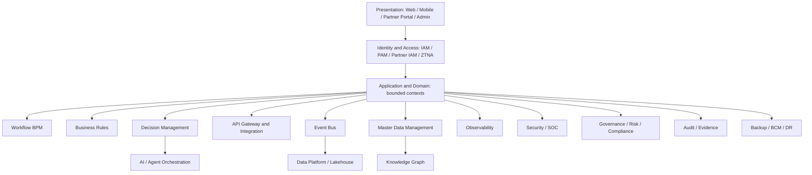

# 1. Enterprise Architecture Blueprint

## 1.1 Purpose

Serengeti EOS is the governed operating system for Serengeti Experience DMC: commercial, MICE, operations, finance, people, technology, security, risk, compliance, continuity, knowledge, and executive command.

It is designed as one connected environment in which **people, processes, data, technology, and AI** operate under human authority.

## 1.2 Operating principle

```
Human authority
    + governed automation
    + AI assistance
    + complete auditability
```

| AI may | AI must not |
| --- | --- |
| Analyze, summarize, classify, predict, correlate | Independently move money |
| Recommend, draft, detect anomalies | Sign contracts or change employment status |
| Generate scenarios, assist investigations | Declare a crisis or send unapproved external communications |
| Execute **pre-authorised, low-risk, reversible** tasks | Change its own autonomy, IAM, or production infrastructure |
| Identify patterns and evidence | Bypass IAM, DLP, SoD, workflow, or audit |

**Recommendation ≠ Decision.** A decision exists only when an authorised human (or a pre-classified safe automation rule) records it through Decision Management.

## 1.3 Architectural style

**Phase 1–2: modular monolith** with strict bounded contexts, schema-per-context (logical), published OpenAPI, transactional outbox, and an internal event bus.

**Phase 3+: extract** high-scale or high-isolation contexts (SOC telemetry, lakehouse, partner API edge) into separately deployable services **only when** operational evidence justifies it.

Rationale: a DMC of this type cannot operate a 40-service mesh on day one. A modular monolith with hard module boundaries is more auditable and recoverable than a premature distributed system. See ADR-0002.

## 1.4 Core layers



All module-to-module communication is through:

1. **Synchronous governed APIs** (in-process ports in the monolith; HTTP/gRPC at extraction time)
2. **Asynchronous domain events** (outbox → bus)
3. **Shared enterprise services** (IAM, audit, config, notification, workflow, rules, decision, AI orchestration)

Direct database access across bounded contexts is forbidden.

## 1.5 Department workspaces vs unified data

Departments receive **workspaces** (navigation, default queues, KPIs). They do not receive separate databases.

The unified enterprise model is anchored on master entities:

`Person · Organisation · PartyRole · Location · Programme · Resource · Contract · MoneyMovement · Incident · Change · Control · Evidence`

Department views are projections over this model with ABAC constraints.

## 1.6 Completeness definition

A capability is complete only when all of the following exist as appropriate:

**UI + API + Data + Authorization + Workflow + Rules + Audit + Testing + Monitoring + Documentation**

A screen without an audit trail, authorisation test, and recovery path is unfinished.

## 1.7 Environments

`Development → Test → UAT → Production`

No feature is developed against Production. Production changes require Change Management (Phase 3+) and, until then, dual-control release approval (Increment 0 policy: local/dev only).
