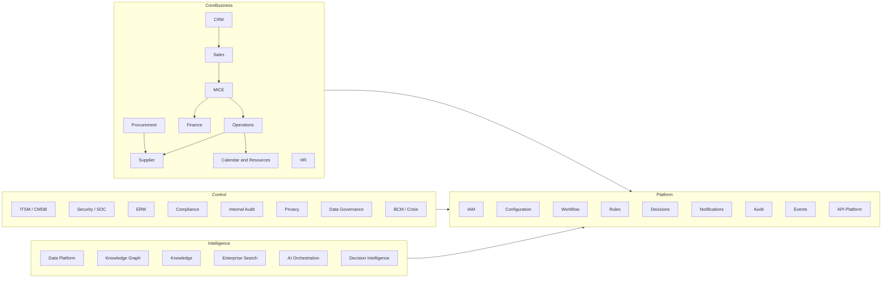

# 2. Complete Module / Domain Map

Bounded contexts are the unit of ownership, data, API, events, and testing. Modules below are **logical**. Physical packaging in Increment 0 is a NestJS modular monolith.

## 2.1 Context map

## 2.2 Domain catalogue

| Domain | Bounded context | Core aggregates | Owner (role) | Phase |
| --- | --- | --- | --- | --- |
| Identity | `identity` | User, Principal, Session, Credential, Role, Policy | CISO / IAM owner | 1 |
| Organisation | `org` | Organisation, Unit, Position, Assignment | CHRO / Admin | 1 |
| Audit | `audit` | AuditEvent, EvidencePointer | Internal Audit / CISO | 1 |
| Configuration | `config` | ConfigItem, Version, Approval | Platform owner | 1 |
| Workflow | `workflow` | ProcessDef, Instance, Task, SLA | COO / Platform | 1 |
| Rules | `rules` | RuleSet, RuleVersion, Simulation | Platform + domain owners | 1 |
| Decision | `decision` | DecisionCase, Recommendation, Authority, Outcome | Domain owners | 1 |
| Notification | `notify` | Message, Template, Delivery, Ack | Platform | 1 |
| CRM | `crm` | Party, Account, Contact, Relationship | Commercial | 2 |
| Sales | `sales` | Lead, Opportunity, Forecast, WinLoss | Head of Sales | 2 |
| MICE | `mice` | Rfp, Programme, Itinerary, Costing, Proposal | Head of MICE | 2 |
| Operations | `ops` | Assignment, Task, GuestNeed, FieldSync | Head of Operations | 2 |
| Supplier | `supplier` | Supplier, Contract, Rate, Performance | Procurement / Ops | 2 |
| Finance | `finance` | Quote, Invoice, Payment, Budget, Reconciliation | CFO | 2 |
| Procurement | `procure` | Request, PO, SourcingEvent | Head of Procurement | 2 |
| HR | `hr` | Employee, Leave, Skill, Certification | CHRO | 2 |
| Calendar | `calendar` | Resource, Booking, Hold | Operations | 2 |
| ITSM | `itsm` | Ticket, Change, Problem, Release | IT Manager | 3 |
| CMDB | `cmdb` | CI, Relationship, Service | IT Manager | 3 |
| Asset | `asset` | Asset, License, Endpoint | IT Manager | 3 |
| Observability | `observability` | Signal, SLO, Alert | IT / SRE | 3 |
| Security | `security` | Detection, Investigation, ContainmentRequest | CISO | 3 |
| Vulnerability | `vuln` | Finding, Exposure, Patch | CISO | 3 |
| PAM | `pam` | PrivilegedAccount, JustInTimeGrant, Session | CISO | 3 |
| Secrets | `secrets` | SecretRef, RotationJob | CISO | 3 |
| ERM | `erm` | Risk, KRI, Treatment | CRO | 4 |
| Compliance | `compliance` | Obligation, Control, Test, Finding | Compliance | 4 |
| Internal Audit | `audit-ia` | Engagement, Workpaper, Opinion | Head of Internal Audit | 4 |
| Privacy | `privacy` | ProcessingActivity, DSR, Consent, DPIA | DPO | 4 |
| Data Governance | `dg` | Dataset, Classification, Lineage, QualityRule | CDO | 4 |
| BCM | `bcm` | BIA, Plan, Exercise, BackupJob | BCM owner | 4 |
| Crisis | `crisis` | Crisis, Timeline, DecisionLog, Comms | Crisis Commander | 4 |
| Emergency Comms | `emcomms` | Tree, Blast, Ack | Crisis / HR | 4 |
| Simulation | `exercise` | Scenario, Inject, Score | BCM / Security | 4 |
| Knowledge | `knowledge` | Document, Version, AuthorityState | KM owner | 5 |
| Search | `search` | IndexedDocument, Query, Hit | Platform | 5 |
| Graph | `graph` | Node, Edge, ImpactQuery | Platform / CDO | 5 |
| Lakehouse | `lakehouse` | Pipeline, Dataset, SemanticModel | CDO | 5 |
| AI Platform | `ai` | Provider, Model, Prompt, Agent, Evaluation | AI owner | 5 |
| Decision Intelligence | `di` | Forecast, Scenario, Backtest | CDO | 5 |
| Integration | `integration` | Connector, Mapping, ProviderRoute | Integration owner | 6 |
| Partner | `partner` | PartnerOrg, Application, Scope, Certification | Commercial + CISO | 6 |
| Process Mining | `mining` | EventLog, Variant, Conformance | COO / CDO | 7 |
| AIOps | `aiops` | Correlation, ProbableCause | IT | 7 |

## 2.3 Shared kernel (never a dumping ground)

Only truly shared concepts live here:

- `TenantId`, `PrincipalId`, `CorrelationId`, `IdempotencyKey`
- Money (`amount`, `currency`, `fxRateId`)
- Classification (`Public | Internal | Confidential | Restricted | HighlyRestricted`)
- Actor type (`Human | Service | AiAgent`)
- Approval outcome (`Pending | Approved | Rejected | Escalated | Expired`)

Business rules of MICE costing, payroll, or SIEM correlation do **not** belong in the shared kernel.

## 2.4 Anti-corruption

| External / future system | Translation |
| --- | --- |
| Hotel CRS / PMS | Supplier + Rate + Availability adapters |
| Accounting / ERP | Finance anti-corruption layer; EOS is not assumed to be the general ledger until ADR |
| IdP | OIDC claims → Principal |
| Email/SMS | Notification channel adapters |
| AI providers | Model/provider ports; never leak vendor types into domain |

## 2.5 Department → workspace mapping

| Department | Default workspace | Primary contexts |
| --- | --- | --- |
| Executive Management | Executive Command Center | All (read + drill-down) |
| Commercial / Sales / Marketing | Commercial | crm, sales, mice |
| MICE | MICE | mice, ops, supplier, finance |
| Operations | Operations / Field | ops, calendar, supplier |
| Finance | Finance | finance, procure |
| Procurement / Supplier Mgmt | Procurement | procure, supplier |
| Human Resources | People | hr, org |
| IT | IT Service | itsm, cmdb, asset, observability |
| Cybersecurity / SOC | SOC | security, vuln, pam |
| Compliance | Compliance | compliance, privacy |
| Enterprise Risk | Risk | erm |
| Internal Audit | Audit | audit-ia, audit |
| Legal | Legal | contracts (supplier/finance), privacy |
| Data / Analytics | Data | lakehouse, di, dg |
| Knowledge Management | Knowledge | knowledge, search |
| BCM / Crisis | Crisis Command | bcm, crisis, emcomms, exercise |
