# 3. System Context

## 3.1 Context diagram

```mermaid
flowchart TB
  subgraph People
    EMP[Employees and contractors]
    EXEC[Executives]
    FIELD[Field staff: guides, drivers, ops]
    AUD[Internal / external auditors]
    PARTNER[B2B partners - future]
    GUEST[Guests - no direct EOS login in Phase 1-2]
  end

  EOS[Serengeti EOS]

  subgraph IdentityProviders
    IDP[Corporate IdP - TBD]
  end

  subgraph Comms
    EMAIL[Email provider - TBD]
    SMS[SMS provider - TBD]
    TEAMS[Teams or approved chat - TBD]
  end

  subgraph BusinessIntegrations["Business systems - existence unconfirmed"]
    ERP[Accounting / ERP]
    BANK[Banking / payments]
    CRS[Hotel / lodge CRS]
    GDS[Air GDS]
    FLEET[Fleet / telematics]
  end

  subgraph CloudAI
    AIP[Primary AI provider - TBD]
    AIB[Backup AI provider - TBD]
  end

  subgraph OpsPlane
    OBS[Observability backend]
    BAK[Backup target 19:00 EAT]
    SEIM[SIEM - Phase 3]
  end

  EMP --> EOS
  EXEC --> EOS
  FIELD --> EOS
  AUD --> EOS
  PARTNER -.-> EOS
  EOS --> IDP
  EOS --> EMAIL
  EOS --> SMS
  EOS --> TEAMS
  EOS -.-> ERP
  EOS -.-> BANK
  EOS -.-> CRS
  EOS -.-> GDS
  EOS -.-> FLEET
  EOS --> AIP
  EOS --> AIB
  EOS --> OBS
  EOS --> BAK
  EOS --> SEIM
```

Dashed lines are **unconfirmed**. No connector will be built until the actual system, owner, contract, and data-processing agreement are identified.

## 3.2 Actors

| Actor | Trust | Access path | Notes |
| --- | --- | --- | --- |
| Employee | Workforce | SSO + MFA + device posture (Phase 3) | Least privilege RBAC+ABAC |
| Contractor | Workforce-limited | Same, time-boxed account | Auto-deprovision on contract end |
| Field staff | Workforce, degraded network | Mobile + offline policy pack | Minimised cache, expiring credentials |
| Executive | Workforce | Same + Command Center | Still not above audit or SoD |
| Auditor | Workforce or time-boxed | Read + evidence export | Cannot alter production data |
| Partner user | External tenant | Partner IAM + scoped APIs | Never sees internal tenant data |
| Service account | Workload identity | mTLS / signed tokens | No human MFA bypass for humans |
| AI agent | Workload identity | Tool registry + data scopes | Cannot self-approve |
| Guest | Out of band | None in Phase 1–2 | Guest data is processed, not an EOS login |

## 3.3 Data flows (summary)

See also [15-trust-boundaries.md](15-trust-boundaries.md).

| Flow | Direction | Classification default | Control |
| --- | --- | --- | --- |
| User → EOS API | In | Session | OIDC, TLS, step-up for privileged |
| EOS → PostgreSQL | Internal | Mixed | Private network, encryption at rest |
| EOS → Event bus | Internal | Mixed | AuthN, schema, ACLs |
| EOS → AI provider | Egress | Filtered | DLP strip, purpose limitation, no Highly Restricted unless approved |
| EOS → Notification providers | Egress | Internal / Confidential | Template allowlist, external crisis approval |
| EOS → Backup | Egress | Highly Restricted possible | Encrypted, 19:00 EAT, restore-tested |
| Partner API | Ingress/egress | Scoped | Separate edge, tenant isolation |

## 3.4 Out of scope until approved

- Guest-facing booking website
- Payment card acquisition / storage
- Offensive security tooling
- Silent failover of financial postings
- Training AI models on client personal data without DPIA
