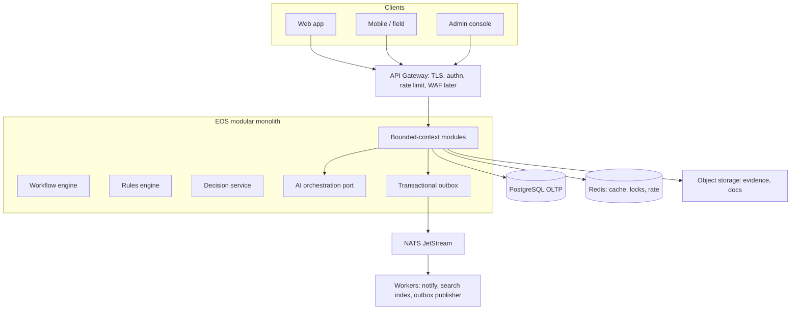

# 4. Logical Architecture

## 4.1 Runtime view (Phase 1)

## 4.2 Module communication rules

1. Modules call each other only through **application ports** (interfaces), never by importing another module’s tables.
2. Cross-context *facts* propagate as **domain events**.
3. Cross-context *commands* that must be synchronous (e.g. “is this principal allowed?”) go through enterprise services (IAM, rules, decision).
4. Long-running work uses workflow + timers, not HTTP timeouts.
5. Idempotency keys are mandatory on all money, booking, and approval commands.

## 4.3 Presentation principles

UI priority: **Clarity → Action → Evidence → Context**

| Surface | Audience | Notes |
| --- | --- | --- |
| Department workspace | Staff | Queues, tasks, records |
| Executive Command Center | Executives | KPI → problem → evidence → owner → action |
| Crisis Command Center | Crisis team | Timeline, decisions, comms; humans command |
| SOC dashboard | Security | Defensive detections only |
| Admin console | Privileged admins | PAM-gated |
| Partner portal | External | Isolated tenant, later phase |

## 4.4 Offline field architecture (logical)

Field clients hold a **policy-controlled encrypted cache**:

- Only assigned programmes, tasks, guest operational needs, emergency SOPs
- Credentials expire
- Sync is last-write with domain conflict rules (not blind LWW for money or guest identity)
- Remote wipe via UEM (Phase 3)

## 4.5 Target extraction (not now)

Extract when SLOs or isolation require it:

| Candidate | Trigger |
| --- | --- |
| Partner API edge | First external tenant |
| Telemetry/SIEM pipeline | Phase 3 SOC |
| Lakehouse | Phase 5 analytics volume |
| AI gateway | Multiple providers + token cost control at scale |
