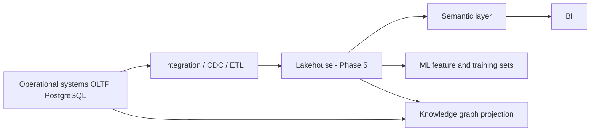

# 5. Data Architecture

## 5.1 Principle

Business-critical facts live in **structured, constrained, authorised records**. AI text is never the system of record.

## 5.2 Planes

| Plane | Store | Use |
| --- | --- | --- |
| Operational | PostgreSQL 16 | Transactions, workflows, audit pointers |
| Immutable audit | PostgreSQL + hash-chained audit table; WORM object store later | Consequential actions |
| Documents / evidence | Object storage | Files, workpapers, IR evidence |
| Cache | Redis | Sessions (optional), locks, rate limits — not source of truth |
| Events | NATS JetStream | Integration, notifications, analytics ingest |
| Analytics | Lakehouse TBD (ADR) | Historical, BI, ML |
| Graph | Property graph TBD (ADR) | Impact analysis |
| Search index | OpenSearch TBD | Permission-aware retrieval |

## 5.3 Record patterns

Every operational table includes:

- `id` (UUID v7 preferred)
- `tenant_id`
- `created_at`, `created_by_principal_id`
- `updated_at`, `updated_by_principal_id`
- `row_version` (optimistic concurrency)
- `deleted_at` (soft delete where legally allowed; hard delete only via approved erasure workflow)

Immutable tables (audit, decision outcomes, crisis timeline entries, financial postings once posted):

- No UPDATE of business fields
- Corrections via reversing / superseding records

## 5.4 Master data

MDM owns golden records for:

- Party (person/org)
- Location / destination
- Supplier
- Employee
- Vehicle / resource types
- Chart of accounts mapping (if EOS posts; else external ERP keys)
- Classification schemes and retention schedules

Survivorship rules are versioned configuration, not hardcoded.

## 5.5 Classification and handling

| Level | Examples | Default controls |
| --- | --- | --- |
| Public | Marketing destination facts after approval | Standard TLS |
| Internal | Org charts, non-sensitive SOPs | Authenticated |
| Confidential | Pipeline, costing, supplier rates | Need-to-know ABAC, DLP |
| Restricted | Guest passports, health, HR cases | Purpose limitation, step-up auth, no AI egress by default |
| Highly Restricted | Credentials, PAN if ever in scope, IR evidence, break-glass | Vault, dual control, no AI, no partner APIs |

Every sensitive flow records: **Owner → Purpose → Classification → Access Policy → Retention → Security Controls → Audit Trail**

## 5.6 Privacy data lifecycle

`Collect → Use → Share → Store → Retain → Archive/Delete`

Consent is **one possible lawful basis**, not the default. Lawful basis is recorded per processing activity (ADR pending legal). Tanzania PDPA 2022 and, if applicable, Kenya DPA 2019 and GDPR are **considerations for legal review**, not claimed certifications.

## 5.7 Analytical vs operational

Operational queries stay on OLTP with strict indexes.

Heavy aggregations (forecasting, process mining, SIEM) run on the analytical plane. Phase 1 executives use operational rollups with documented freshness, not a fake warehouse.
