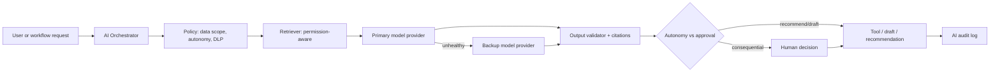

# 7. AI Architecture

## 7.1 Position in the stack

AI is an **assistance and bounded-automation layer**, not an authority. It sits behind:

IAM → DLP / classification → Tool authorisation → Business rules → Workflow approvals → Audit

An agent cannot call a tool the human principal would not be allowed to invoke in that context, except for explicitly listed service tools that operate on **already authorised** work items.

## 7.2 Orchestration

Providers are **not hardcoded**. Registry includes: provider id, models, credentials ref, health, cost limits, failover policy, data-residency constraints.

## 7.3 Registries

| Registry | Contents |
| --- | --- |
| Provider | Primary/backup, health, regions, contracts |
| Model | Version, eval status, allowed data classes |
| Prompt | Versioned, approved, effective-dated |
| Agent | Identity, owner, purpose, tools, scopes, autonomy ceiling, risk class |
| Tool | IAM-mapped action, side-effect class, approval requirement |
| Knowledge source | Authority state, classification, version |
| Evaluation | Datasets, scores, regression gates |

## 7.4 Autonomy levels (ceiling, not floor)

| Level | Name | Allowed |
| --- | --- | --- |
| 0 | Observe | Read telemetry; no user-visible output that looks like advice without disclaimer |
| 1 | Recommend | Structured recommendation + evidence + confidence |
| 2 | Draft | Draft artefacts that remain unpublished until human accept |
| 3 | Execute low-risk | Pre-classified reversible actions (e.g. create a draft ticket) |
| 4 | Conditional automation | If rules + confidence + SoD all pass |
| 5 | Never autonomous | Designated consequential classes — human only |

Administrators configure **which action classes** are permitted at each level. Changing that map is itself a Level 5 / dual-control change.

## 7.5 Safety controls

- Prompt-injection defenses: untrusted content is data, never instructions
- Tool allowlists per agent
- Output schema validation
- Sensitive-data filtering on egress
- Citation required for knowledge answers; otherwise explicit uncertainty
- Confidence thresholds; below threshold → escalate, do not act
- Hallucination tests in CI for prompts/agents
- Model and prompt version recorded on every AI audit event
- Token/cost budgets and kill-switches
- AI incident type in the unified incident model

## 7.6 Agents (catalogue — not all implemented now)

Each agent is a principal. Default autonomy: **1 (Recommend)** until a domain owner approves a higher ceiling.

RFP analysis, Proposal assistance, Sales intelligence, Supplier research, Operations assistance, Finance assistance, Procurement assistance, HR assistance, IT support, SOC analysis, Compliance monitoring, Risk analysis, Internal audit assistance, Knowledge management, Executive intelligence.

## 7.7 Failover

See [18-primary-backup-providers.md](18-primary-backup-providers.md). Failover of AI providers must not silently send Highly Restricted data to a new region or vendor.
