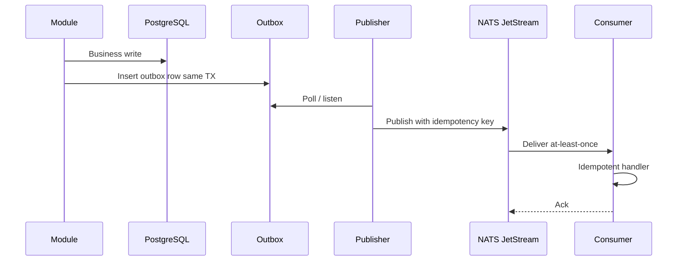

# 9. Event Architecture

## 9.1 Purpose

Events decouple notifications, analytics, search indexing, graph projection, workflow timers, and integrations. They do not replace transactions for money or inventory.

## 9.2 Reliability pattern



Consumers must be **idempotent**. Poison messages go to a dead-letter stream with operator alerting. Replay is supported via retained JetStream (and later, an archive).

## 9.3 Event governance registry (mandatory metadata)

Every event type has:

- Owner, publisher, consumers
- Classification
- JSON Schema (and schema registry subject)
- Compatibility mode (backward default)
- Retention
- Delivery (at-least-once)
- Encryption / ACL
- Lifecycle (draft, active, deprecated)

Unregistered events cannot be published in Test+.

## 9.4 Naming

`sedmc.<domain>.<entity>.<action>.v<n>`

Example: `sedmc.identity.principal.suspended.v1`

Envelope:

```json
{
  "eventId": "uuid",
  "type": "sedmc.identity.principal.suspended.v1",
  "occurredAt": "ISO-8601",
  "tenantId": "uuid",
  "correlationId": "uuid",
  "causationId": "uuid",
  "producer": "identity",
  "actor": { "type": "Human", "principalId": "uuid" },
  "classification": "Confidential",
  "payload": {}
}
```

## 9.5 Phase 1 bus

NATS JetStream (ADR-0004). Kafka is a scale-out option, not the starting bus.

## 9.6 Initial catalogue

See [23-initial-event-catalogue.md](23-initial-event-catalogue.md).
