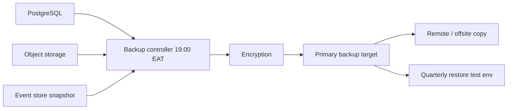

# 12. BCM and Disaster Recovery Architecture

## 12.1 Objectives

Keep critical DMC operations (guest safety, in-progress programmes, payments, crisis comms) recoverable within approved RTO/RPO. **A backup job completing is not a successful backup.** Recoverability tests are required.

## 12.2 Binding backup requirement

**Daily encrypted backup at 19:00 EAT**, plus offsite/remote copy, plus periodic restore tests.

Verification: restore to an isolated environment, checksum/application-level probe, record evidence in BCM.

## 12.3 Criticality model (initial proposal — owners must confirm)

| Service | Proposed criticality | Proposed RTO | Proposed RPO | Manual workaround |
| --- | --- | --- | --- | --- |
| Identity | 1 | 1 h | 15 min | Break-glass PAM accounts |
| Programme operations / field SOPs | 1 | 4 h | 1 h | Offline packs |
| Finance postings | 1 | 4 h | 15 min | Paper + later catch-up |
| CRM / MICE quoting | 2 | 8 h | 1 h | Local files (controlled) |
| Analytics / AI | 3 | 24–72 h | 24 h | Defer |
| Partner APIs | 2 | 8 h | 1 h | Status page + manual |

Values are **assumptions pending BIA workshops** (ADR flag).

## 12.4 Backup architecture

## 12.5 Continuity artefacts per critical service

Owner, criticality, dependencies, RTO, RPO, continuity plan, recovery procedure, manual workaround, alternative provider/resource, test schedule, last test evidence.

## 12.6 Offline continuity

Approved emergency SOPs, programme contact trees, and guest operational constraints are packaged for field offline use. Packages expire and are re-issued. They do not include Highly Restricted dumps.

## 12.7 DR environments

Warm standby is a **cost decision** (ADR-0006). Until approved, document a restore-from-backup DR path and do not claim hot-site capability.
