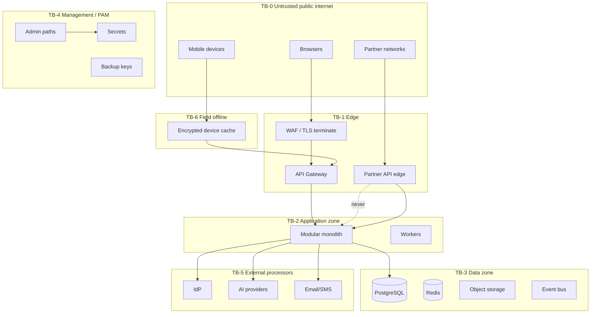

# 15. Trust Boundaries

| Boundary | Rule |
| --- | --- |
| TB-0 → TB-1 | TLS, rate limit, bot/abuse controls |
| TB-1 → TB-2 | Authenticated principal required except health/JWKS |
| Partner edge → app | Partner audience tokens only; no workforce cookies |
| TB-2 → TB-3 | Private network, least-privilege DB roles |
| TB-2 → TB-5 | Egress allowlist, DLP, no Highly Restricted by default |
| TB-4 | Dual control, session recording (PAM Phase 3) |
| TB-6 | Minimised data, expiry, remote wipe, re-auth on sync |
| AI tools → data | Same ABAC as human; citations; no boundary bypass |

Network location is **not** a sufficient credential.
