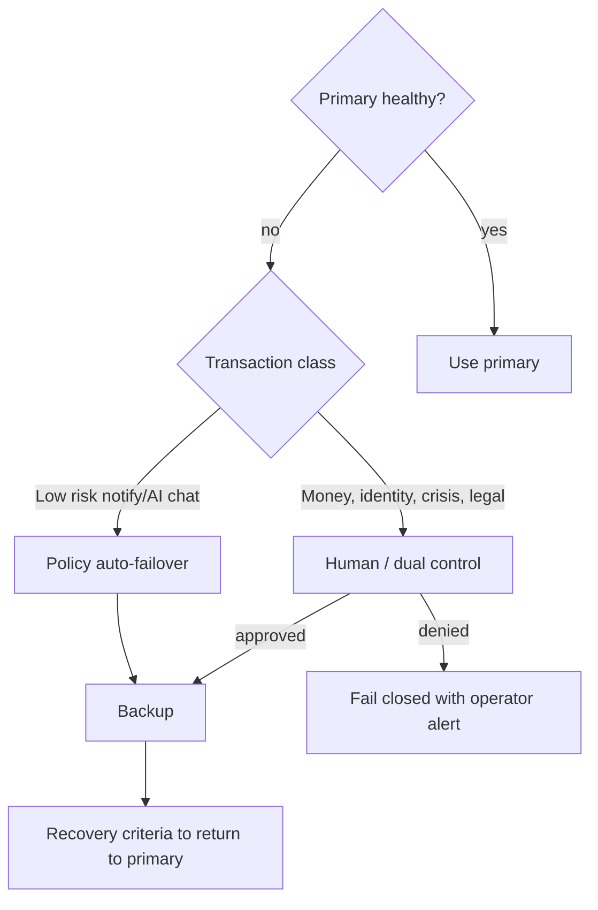

# 18. Primary / Backup Provider Architecture

## 18.1 Policy

Critical external capabilities have a **primary** and a **backup** provider, each with its own credentials, limits, health checks, and audit.

Failover is **controlled**, never silent for sensitive transactions.

## 18.2 Decision flow

## 18.3 Capability classes (providers TBD — do not invent vendors as contracted)

| Capability | Fail closed if no backup? | Auto-failover allowed? |
| --- | --- | --- |
| AI completion | Degrade to non-AI | Only if data class ≤ Internal and region allowed |
| Email | Queue and retry | Yes for Internal templates |
| SMS | Queue | No for crisis external without approval path |
| Payments | Fail closed | No |
| IdP | Break-glass local PAM | No automatic second IdP without test |
| Object storage | Fail closed | No |
| DNS / hosting | Per DR plan | No silent DNS cut without change |

## 18.4 Required controls per route

Health monitor, routing policy, failover criteria, recovery criteria, transaction safety (idempotency), provider-specific credentials and limits, audit of every switch including who/what authorised it.

## 18.5 Data residency

Backup provider in another country is a **privacy/transfer** decision. Default: do not fail over Restricted+ data to an unapproved region.
