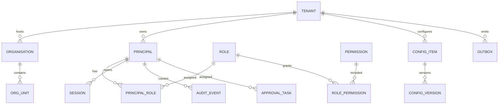

# 21. Initial Database Schema (Increment 0 kernel)

System of record: PostgreSQL. UUID primary keys. `tenant_id` on all tenant-scoped tables. This schema is the **authoritative kernel**; later domains extend it via additive migrations.

Full DDL: [`../../packages/db/schema.sql`](../../packages/db/schema.sql)

## 21.1 Kernel entities

## 21.2 Table summary

| Table | Purpose | Mutability |
| --- | --- | --- |
| `tenants` | Logical isolation (internal vs future partner) | Soft delete |
| `organisations` | Legal / operating orgs | Update |
| `org_units` | Departments / desks | Update |
| `principals` | Human, service, AI agent | Update; deprovision flag |
| `principal_credentials` | Local IdP only (Dev/Test) | Secret hashes |
| `roles` | RBAC | Version via replace |
| `permissions` | `domain:action:resource` | Seeded |
| `role_permissions` | Mapping | Update |
| `principal_roles` | Assignment with scope + expiry | JIT expiry |
| `abac_policies` | Attribute rules | Versioned |
| `sessions` | Auth sessions | Revocable |
| `audit_events` | Consequential log + hash chain | **Insert only** |
| `config_items` | Admin configuration | Via versions |
| `config_versions` | Approved snapshots | Insert + status |
| `approval_tasks` | Human gates | State machine |
| `sod_rules` | Segregation of duties | Versioned |
| `outbox_events` | Reliable publish | Processed flag |
| `idempotency_keys` | Exactly-once commands | TTL |

## 21.3 Audit hash chain

Each row stores `prev_hash` and `row_hash = SHA-256(prev_hash || canonical_payload)`. Application role has **INSERT only** on `audit_events`. Updates are blocked by trigger.

## 21.4 Later domains

CRM/MICE/Finance tables are **not** created empty for show. They arrive with Phase 2 migrations when the domain is built. A stub `schema_registry` records planned contexts.
