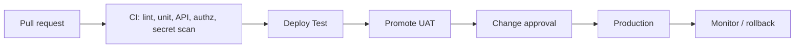

# 25. Initial CI/CD Architecture

## 25.1 Pipeline stages

| Stage | Runs | Blocks merge? |
| --- | --- | --- |
| Lint / typecheck | Always | Yes |
| Unit tests | Always | Yes |
| Authorisation tests | Always | Yes |
| Secret scan | Always | Yes |
| Dependency audit | Always | High severity yes |
| SAST | Always | Policy-based |
| API contract tests | Always | Yes |
| Build image | After tests | Yes |
| Deploy Test | On main | — |
| DAST | Test nightly | Findings ticketing |
| UAT promote | Manual | — |
| Production | Dual control + change record | — |
| AI eval | When prompts/agents change | Yes |
| Restore probe | Scheduled | Alert BCM |

## 25.2 Environment promotion

Artifacts are **immutable**. The same image digest moves Test → UAT → Prod. Config differs by environment via the configuration registry, not by rebuilding.

## 25.3 Increment 0

GitHub Actions workflow runs lint + vitest on push. No Production deploy exists. Claiming CD to Production would be false.
