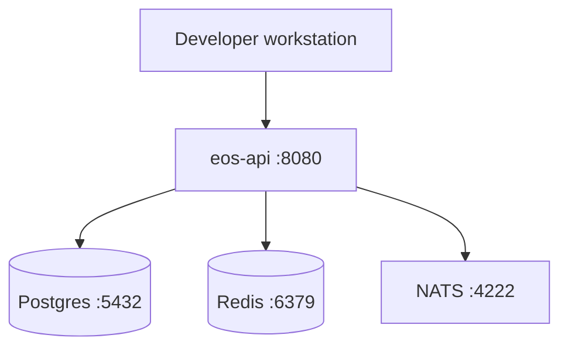

# 27. Initial Deployment Architecture

## 27.1 Increment 0 (local Development)

Compose file: `infra/compose/dev.yaml`. Optional until developers run the full stack; kernel tests do not require Docker.

## 27.2 Target (pending ADR-0006)

| Environment | Purpose | Data |
| --- | --- | --- |
| Development | Coding | Synthetic |
| Test | CI + integration | Synthetic / anonymised |
| UAT | Business acceptance | Anonymised or approved subset |
| Production | Live | Live — separate accounts and keys |

Network: public edge, private app, private data, isolated management.

No Production cluster is provisioned in this increment.

## 27.3 Runtime topology (proposed)

- 2+ API replicas behind gateway
- Workers separate from API
- PostgreSQL primary + backup 19:00 EAT
- Redis HA later
- NATS cluster later
- Object storage with versioning

## 27.4 Configuration

Environment variables point to secret **references**. Business thresholds live in `config_items`, not in code.
