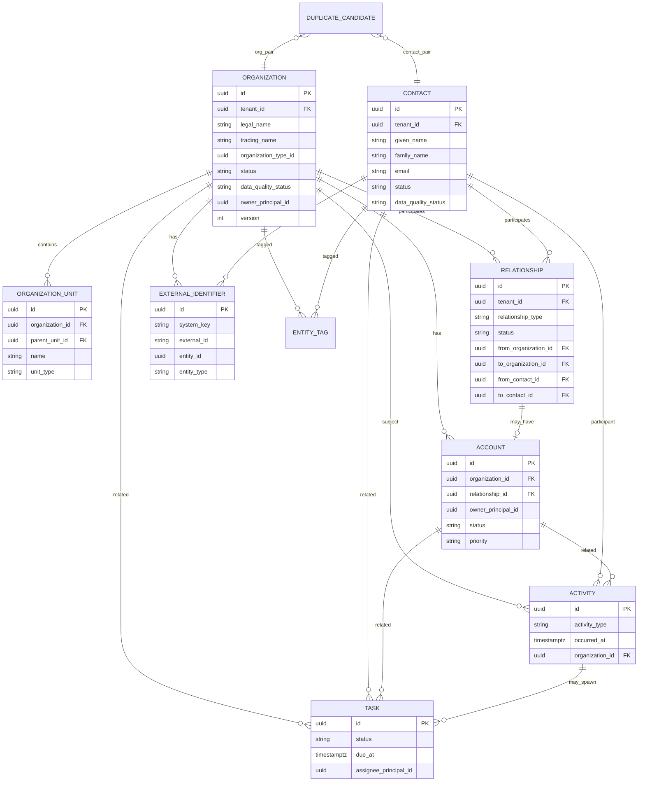

# C1 — Domain Model & Entity Relationships

**Status:** Proposed — Dev/Test only

## Conceptual chain

```
Organization → Organization Units → Contacts → Relationships → Account
  → (C2+) Opportunities → RFPs
```

C1 stops at Account + Activities + Tasks. Foreign keys and nullable refs prepare C2+ without implementing those domains.

## ER diagram



## Organization attributes (minimum)

`id`, `tenantId`, `legalName`, `tradingName`, `organizationTypeId`, `country`, `region`, `market`, `website`, `domain`, `primaryEmail`, `primaryTelephone`, `address` (structured JSON or normalized columns), `status`, `dataQualityStatus`, `classification`, `ownerPrincipalId`, `source`, `createdAt`, `updatedAt`, `createdByPrincipalId`, `updatedByPrincipalId`, `version`, `archivedAt?`, `mergedIntoId?`

## Organization unit

Supports hierarchy: division, department, branch, regional office, subsidiary, business unit. Example: Global Travel Group → Europe → MICE Division → Contact.

## Contact attributes (minimum)

`id`, `tenantId`, `givenName`, `familyName`, `preferredName`, `jobTitle`, `department`, `email`, `telephone`, `mobile`, `country`, `timezone`, `language`, `status`, `communicationPreferences`, `source`, `dataQualityStatus`, `classification`, audit fields, `mergedIntoId?`

Contacts may belong to **multiple** organizations via Relationship — not a single `organization_id` FK.

## Relationship (first-class)

Types (configurable catalogue): employee_of, decision_maker_at, buyer_at, procurement_contact_at, mice_planner_at, preferred_partner_of, referral_partner_of, supplier_of, subsidiary_of, parent_organization_of, …

Endpoints:

- Contact → Organization
- Organization → Organization
- (Future) Contact → Contact

## Account

Commercial view: `accountOwner`, `market`, `strategicClassification`, `priority`, `estimatedCommercialValue`, `nextAction`, `lifecycleStatus`. Organization remains authoritative master data.

## Activity vs Note

- **Activity:** structured interaction (type, subject, datetime, participants, outcome)
- **Note:** lightweight annotation attachable to org/contact/account/activity

Activity types: Email, Telephone, Meeting, Video Meeting, Message, Trade Show, Site Inspection, Sales Call, Presentation, Follow-up, Proposal Discussion, Other.

## External identifier

Explicit table — do not invent system IDs. `systemKey` references a governed catalogue aligned with [external-systems-register](../../discovery/external-systems-register.md).

## Tags / classification

Tenant-scoped tag catalogue + `entity_tags` junction. Supports segmentation without overloading organization type.

## Distinction from I1 Admin org

| I1 Admin Shell | C1 CRM |
| --- | --- |
| Serengeti internal org hierarchy | **Customer/partner** organizations |
| Internal cost centers, locations | Commercial relationship data |

Separate bounded context; no shared tables.
